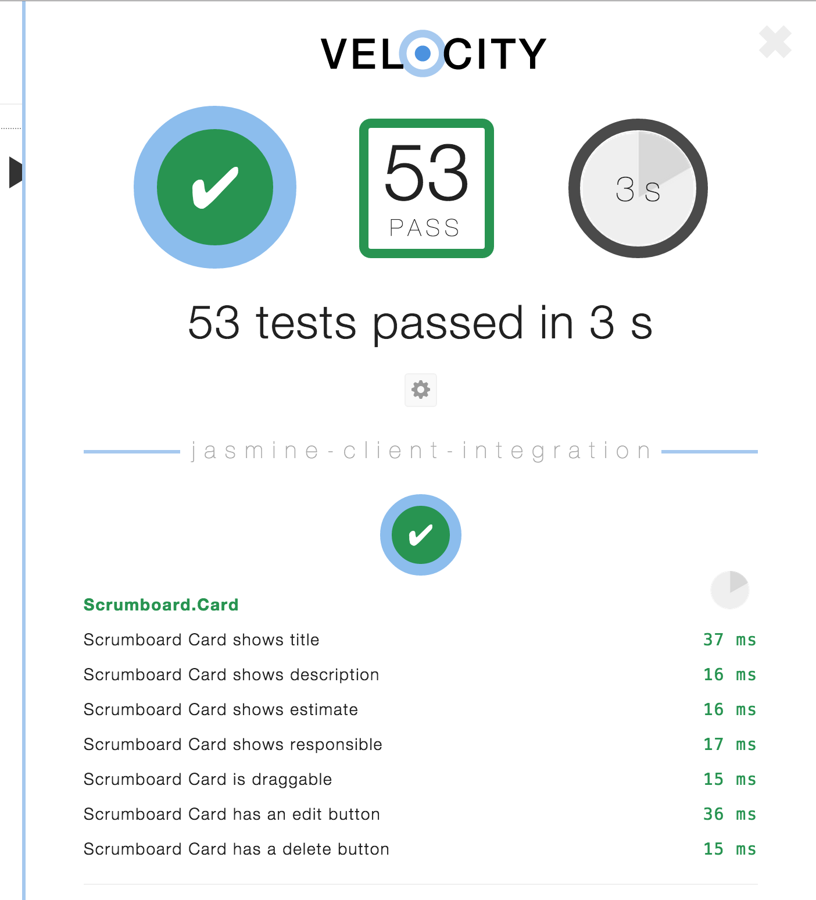

# Scrumboard
Scrumboard - little project for ZHAW

See scrumboard.macrozone.meteor.com

## Usage

Create new Cards, add title, description, estimate and a responsible person. Move Cards to other columns with Drag&Drop or use the buttons. You can also delete and edit cards.

In description, you can use markdown to format the text, if you want.

## Why Meteor?

- Its easy
- It has live-data out-of-the-box (trough websockets and fallbacks)
- It enables you to focus on the actual problem you want to solve with your app. 
- You have one code-base though the entire stack, from client to server to database. No more messing with data-wiring or writing boilerplate. 
- It allows you to share logic between server and client: Form-validation on both client an server? You get it out-of-the-box (thanks to aldeed:autoform)
- It integrates nicely with node-ecosystem
- It integrates nicely with test-frameworks
- It makes development really fast
- It has a great commmunity and nice packages
- It is a good example how modern web-frameworks should work.

and most of all: 

- i am lazy 
- i want to get things done
- **its fun!**

## Tests

If you run it on develop, you'll find a velocity-test-button on the top right corner:



The Tests are in app/tests directory and are written with [Jasmine](http://jasmine.github.io/). It has client-integration tests, as well as server-tests to test the additional REST-APi. There aren't any unit-tests as there is hardly any custom business-logic.

## Api

Scrumboard provides two APIs: DDP and REST

### DDP (Highlevel, Live-Data)

DDP is a live-data-protocol on top of websockets, it supports Pub/Subs and Remote Calls. Scrumboard publishes it cards under subscription "cards". You can do every operation on the collection at the moment, as it is not restricted.

There are multiple ddp implementations (meteor, node, java, ruby, ...) wich should work.

Meteor example:
```javascript
  var connection = DDP.connect("scrumboard.macrozone.ch");
  var Cards = new Mongo.Collection("cards", connection);
  connection.subscribe("cards");
  // now you have cards in your "cards" collection
```
See https://github.com/macrozone/Scrumboard/blob/master/app/collections.coffee for the schema

### REST (lowlevel)

There are the following routes (CRUDL):
```
  GET     /api/cards
  GET     /api/cards/:id
  POST    /api/cards/:id
  PUT     /api/cards/:id
  DELETE  /api/cards/:id
```
See https://github.com/macrozone/Scrumboard/blob/master/app/collections.coffee for the schema (json)

Authentification is not required at the moment as this is a demo.

## install

1. Install meteor `curl https://install.meteor.com/ | sh`
2. checkout project and `cd app; meteor`
3. ????
4. profit


## deploy

run `meteor deploy scrumboard.macrozone.meteor.com``

This will deploy the application under meteors test/development-hosting. I normally use dedicated node hosting for this, but I like the one-command-deployment and wanted to show it.

Bundling as node application (+ cordova app) is easy, however:

Run `meteor build` and you get a tarball that you can run anywhere where node is present (node 0.10.36 atm.). It requires a MongoDB (2.4) for persistence.


